# Machine Learning Project (Regression & Clustering) on Kalbe Nutritionals

## Project Description

Data scientist in Kalbe Nutritionals got a new project from :

1. Inventory Team to predict sum of quantity from all products, so they could create sufficient daily inventory.
2. Marketing Team to create cluster or segment of customer to get personalized promotion and sales treatment

The challenges in this project include :

1. Perform **Data Ingestion** into dbeaver and PostgreSQL.
2. Perform **Exploratory Data Analysis (EDA)** to know the average age of customer based on marital status and gender, also the best-selling store and product name.
3. **Visualizing Data Dashboard** using Tableau
4. Make **Machine Learning Regression Model** (Time Series) with ARIMA
5. Make **Machine Learning Clustering Model** with KMeans Algorithm

---

## Project Goal

1. Estimate the quantity of products sold for daily stock inventory
2. Create a segment of customers for marketing promotion

## Tools & Library Used

 &nbsp;
 &nbsp;
 &nbsp;
 &nbsp;
 &nbsp;

 &nbsp;
 &nbsp;
 &nbsp;
 &nbsp;
 &nbsp;

## Dataset Used

- [Customer](https://github.com/nickenshidqia/KalbeNutritionals_TimeSeries_Arima_DataScience/tree/main/Dataset)
- [Product](https://github.com/nickenshidqia/KalbeNutritionals_TimeSeries_Arima_DataScience/tree/main/Dataset)
- [Store](https://github.com/nickenshidqia/KalbeNutritionals_TimeSeries_Arima_DataScience/tree/main/Dataset)
- [Transaction](https://github.com/nickenshidqia/KalbeNutritionals_TimeSeries_Arima_DataScience/tree/main/Dataset)

## Project Result

### Data Ingestion and Exploratory Data Analysis using PosgreSQL & DBeaver

[Click here to get on SQL data](https://github.com/nickenshidqia/KalbeNutritionals_TimeSeries_Arima_DataScience/blob/main/Script%20EDA%20DBeaver.sql)

On DBeaver we import dataset in Postgres public schema. There are 4 csv file that is used :  
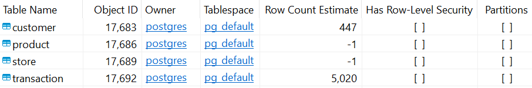

**The challenge results are** :  
**Query 1** : Average customer age based on their marital status  
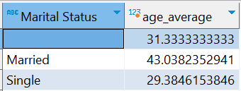  
**Query 2** : Average customer age based on their gender  
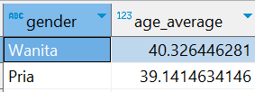  
**Query 3** : Store name with the highest total quantity  
  
**Query 4** : The best-selling product with the highest total amount  
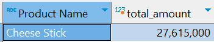  
To see the entire query code you can look at : [link here](https://www.google.com/)

## Dashboard Visualization Using Tableau

[Click here to get on Dashboard Visualization](https://github.com/nickenshidqia/KalbeNutritionals_TimeSeries_Arima_DataScience/blob/main/Sales%20Dashboard.png)

The dashboard visualization on entire worksheet :  

**Worksheet 1** : Total quantity from month to month  
  
**Insight :**

- Sales trends fluctuate slightly, and show a gradual decline starting from June.
- The highest total quantity sold is in March 2022 with 1,753 items
- The lowest total quantity sold is in December 2022 with 1,409 items

**Worksheet 2** : Total amount from day to day  
  
**Insight :**

- Daily revenue trends fluctuate heavily
- The highest total amount is in March 2022 with Rp 976,500
- The lowest total amount is in August 2022 with Rp 123,600

**Worksheet 3** : Total quantity by product  
  
**Insight :**

- The highest selling product in 2022 is Thai Tea with 2,853 items sold.
- The lowest selling product in 2022 is Cashew with 627 items sold.

**Worksheet 4** : Total sales amount by store name  
  
**Insight :**

- The best-selling store in 2022 is Lingga with sales revenue reached Rp 25,294,100.
- The lowest-selling store in 2022 is Buana Indah with sales revenue reached Rp 10,629,900.

## Daily Product Quantity Prediction Using Time Series Arima

[Click here to get on ARIMA and KMeans Clustering](https://github.com/nickenshidqia/KalbeNutritionals_TimeSeries_Arima_DataScience/blob/main/ARIMA%20%26%20KMeans%20for%20Sales%20Prediction%20%26%20Segmentation.ipynb)

### Data Cleaning

**Fix data type error**  
Fix data type error for 'Latitude', 'Longitude', and 'Income' from coma (,) to point (.)  
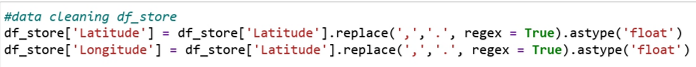  
Before cleaning :  
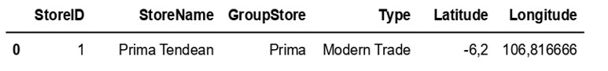  
After Cleaning :  
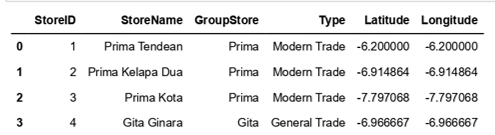

**Drop Missing Values :**  
Drop missing values on 'Marital Status' for 3 row  
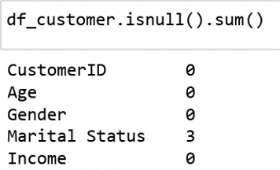

### Data Merging

Merging all dataset into one data :  

### Create New Dataset

Create new dataset by grouping date and total quantity :  
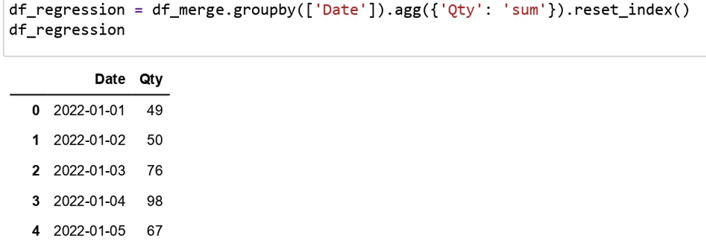  
Here is the plot of new dataset :  
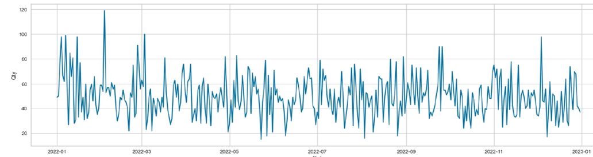

### Seasonal Decomposition

According to trend, seasonality, and residual, the sales trend are quite fluctuative and indicate downtrend.  
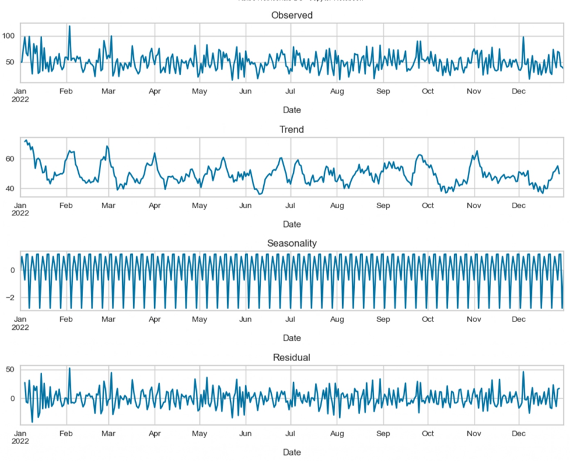

### Augmented Dicky-Fuller (ADF) Test

Based on ADF statistic, the p-value is 0.0 < 0.05, then reject H0 and accept H1. Therefore data is stationary.  

### Data Training & Testing

Splitting the data with 80% training and 20% testing. Blue line is data training, and green line is data testing.
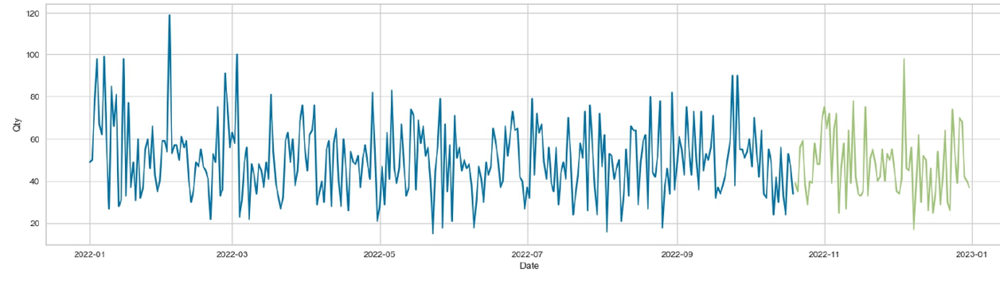

### Find p,d,q for ARIMA Model

**Model 1 - Auto-fit ARIMA**  
Get result with p,d,q = 1,0,1. ARIMA (1,0,1) means there is no Differencing (0) because it is stationary, with Autoregression for 1 lag and 1 order Moving Average.  
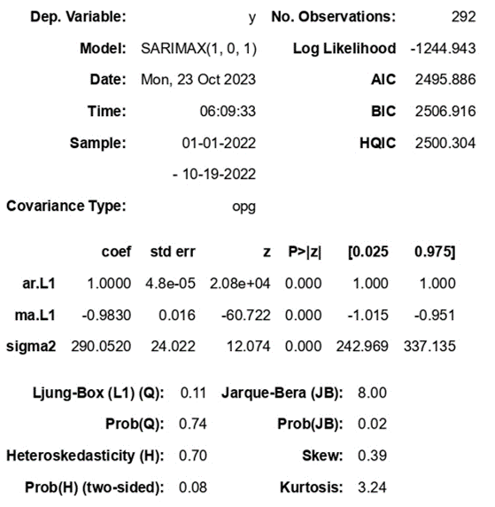

**Model 2 - ACF & PACF Plot**  
Get result with p,d,q = 28,0,28 from ACF and PACF plot.  

**Model 3 - Autocorrelation Plot**  
Get result with p,d,q = 44,0,44 from Autocorrelation plot.  
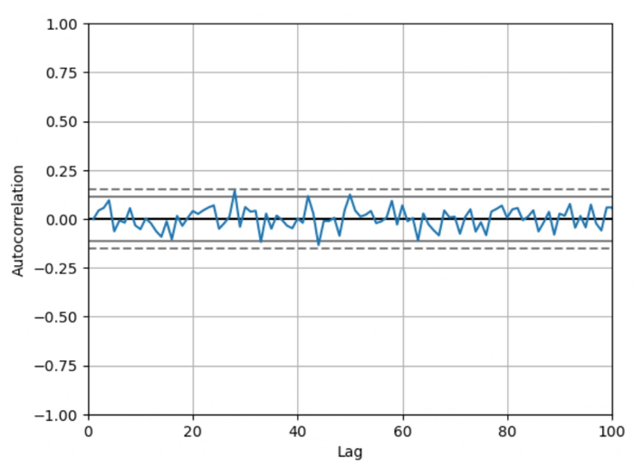

**ARIMA Modelling Plot**  
Plot Data Train, Test, and Model Prediction  
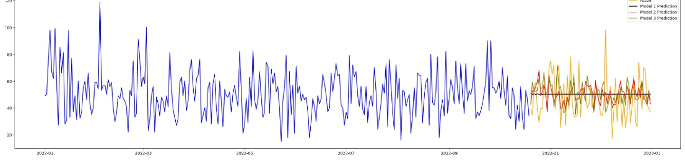

**Forecast Quantity Sales With The Best Parameter**  
Model 2 with p,d,q (28,0,28) show the best metric evaluation because has the lowest MAE, MSE, RMSE, and MAPE.  
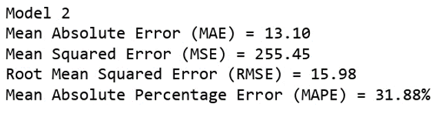

Prediction for quantity on January 2023 is 50 pcs/day  
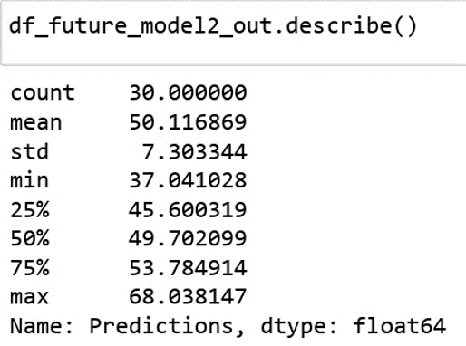

## Customer Segmentation Using KMeans Clustering

### Elbow Method

Find k =4 in Elbow line plot, and input cluster to dataset.  
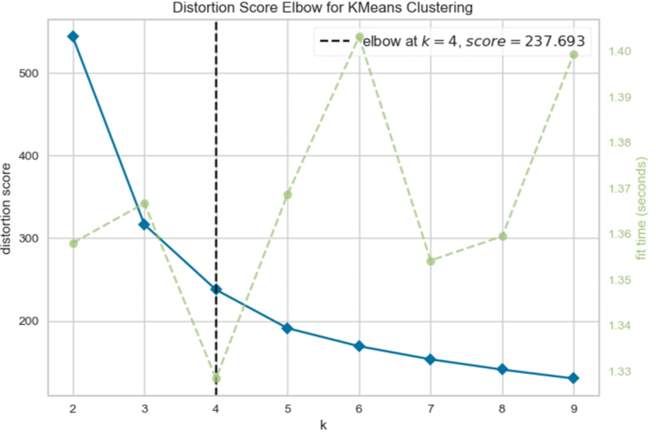

There are 4 cluster of segmentation :  

**Conclusion**

- Cluster 0 is the cluster with the most largest number of customers, but has the second lowest average of quantity and total amount. The strategy is give special offering and discount for new member
- Cluster 1 is the cluster with the second fewest number of customers, and the lowest average of quantity and total amount. One of the strategy is collaborate with influencers to promote products.
- Cluster 2 is the customer that valuable to the business. the strategy is offer loyalty membership
- Cluster 3 has the second largest average of quantity and total amount and has potential of upselling.
